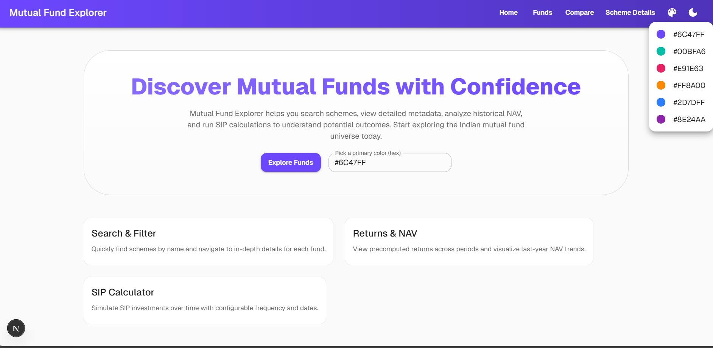
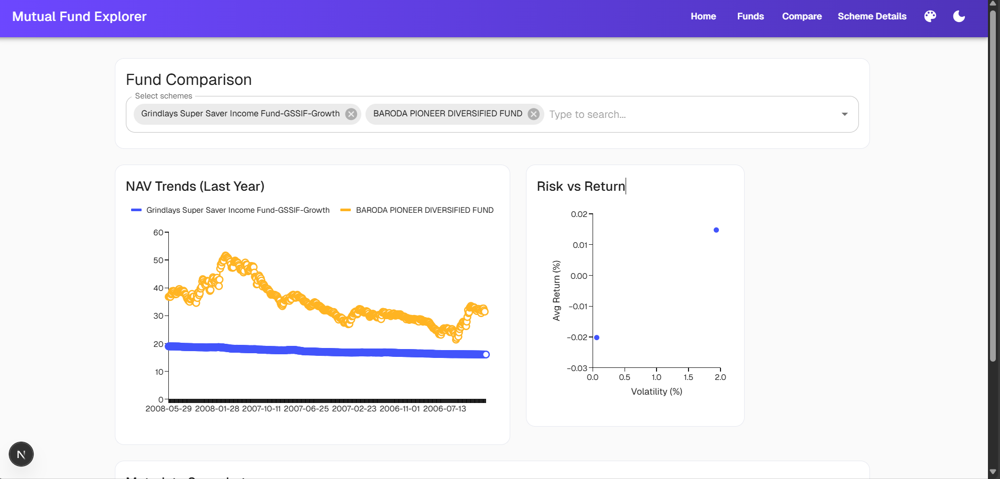
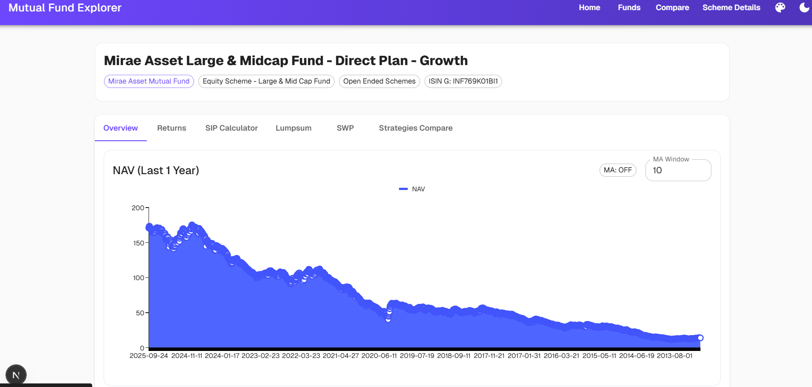

# 🚀 Mutual Fund Explorer - Advanced Investment Analytics

<div align="center">


**A modern, animated financial dashboard for exploring 5,000+ Indian mutual funds with advanced analytics, glassmorphism design, and comprehensive investment calculators.**

[Live Demo](https://mutual-fund-explorer.vercel.app) • [Documentation](#documentation) • [Features](#-features) • [Screenshots](#-screenshots)

</div>

---

## ✨ Overview

Mutual Fund Explorer is a cutting-edge Next.js application that transforms mutual fund analysis into an engaging, modern experience. Built with the latest web technologies, it features glassmorphism design, smooth animations, and comprehensive investment tools.

### 🎯 Key Highlights

- **5,000+ Mutual Fund Schemes** with advanced search and filtering
- **Modern Glassmorphism UI** with gradient backgrounds and blur effects
- **Smooth Animations** powered by Framer Motion
- **Advanced Analytics** with interactive charts and risk assessment
- **Investment Calculators** (SIP, Lumpsum, SWP) with detailed projections
- **Fund Comparison Tool** with side-by-side analysis
- **Dark/Light Themes** with 12+ color schemes
- **Fully Responsive** design for all devices

---

## 🛠️ Tech Stack

### Frontend
- **Next.js 15** with App Router and Turbopack
- **React 19** with modern hooks and concurrent features
- **Material-UI v7** with custom theming and components
- **Framer Motion** for smooth animations and transitions
- **Tailwind CSS** for utility-first styling

### Data & Charts
- **MUI X Charts** for interactive data visualization
- **Chart.js** with React integration
- **Date-fns** for date manipulation and calculations

### Styling & Design
- **Glassmorphism** effects with backdrop blur
- **Gradient backgrounds** and modern color schemes
- **Custom CSS variables** for consistent theming
- **Responsive design** with mobile-first approach

---

## 🚀 Quick Start

### Prerequisites
- Node.js 18+ 
- npm or yarn

### Installation

1. **Clone the repository**
```bash
git clone https://github.com/your-username/mutual-fund-explorer.git
cd mutual-fund-explorer
```

2. **Install dependencies**
```bash
npm install
# or
yarn install
```

3. **Run the development server**
```bash
npm run dev
# or
yarn dev
```

4. **Open your browser**
Navigate to [http://localhost:3000](http://localhost:3000)

### Environment Setup
No special environment variables required for local development. The app uses internal API routes for data fetching.

---

## ✨ Features

### 🎨 Modern UI/UX
- **Glassmorphism Design** with backdrop blur effects
- **Gradient Backgrounds** and smooth color transitions
- **Animated Particles** and floating elements
- **Smooth Page Transitions** with fade and scale effects
- **Interactive Hover Effects** on all components
- **Custom Scrollbars** with gradient styling

### 🏠 Dashboard Landing Page
- **Hero Section** with animated background and call-to-action
- **Statistics Cards** showing key metrics (5,000+ schemes, 15.2% avg returns)
- **Feature Showcase** with glassmorphism cards
- **Quick Navigation** to all major sections

### 💳 Enhanced Fund Discovery
- **Advanced Search** with real-time filtering
- **Glassmorphism Cards** with hover animations
- **Performance Indicators** with mock return data
- **Badge System** for "Top Performer", "Trending", "New" funds
- **Favorite Functionality** with star ratings
- **Sorting Options** by name, favorites, and performance

### 📊 Advanced Analytics
- **Interactive Charts** with smooth transitions
- **NAV Performance Trends** with area fills and moving averages
- **Risk vs Return Analysis** with scatter plots
- **Volatility Metrics** and performance indicators
- **Historical Data Visualization** with customizable timeframes

### 🧮 Investment Calculators
- **SIP Calculator** with animated result cards and projections
- **Lumpsum Calculator** with modern input fields
- **SWP Calculator** for systematic withdrawal planning
- **Strategy Comparison** with side-by-side analysis
- **Loading Animations** and progress indicators
- **Error Handling** with modern alert designs

### 🔍 Fund Comparison Tool
- **Multi-Fund Selection** with autocomplete search
- **Side-by-Side Analysis** with interactive charts
- **Risk Assessment** with volatility metrics
- **Performance Comparison** across different timeframes
- **Metadata Comparison** with fund details

### 🌓 Advanced Theming
- **Dark/Light Mode** with smooth transitions
- **12+ Color Schemes** with instant preview
- **Custom Color Picker** with hex input
- **Persistent Settings** stored in localStorage
- **Gradient Text** and modern typography

---

## 📸 Screenshots

<div align="center">

### 🏠 Modern Dashboard Landing Page


### 🔍 Advanced Fund Comparison


### 📊 Scheme Analytics Dashboard



</div>

---

## 🏗️ Project Structure

```
mutual-fund-explorer/
├── src/
│   ├── app/
│   │   ├── page.js                    # 🏠 Modern Dashboard Landing
│   │   ├── funds/page.js              # 💳 Enhanced Fund Discovery
│   │   ├── compare/page.js            # 🔍 Fund Comparison Tool
│   │   ├── scheme/[code]/
│   │   │   ├── page.js                # 📊 Scheme Analytics Dashboard
│   │   │   ├── returns/route.js       # 📈 Returns API
│   │   │   └── sip/route.js           # 🧮 SIP Calculator API
│   │   ├── api/
│   │   │   ├── mf/route.js            # 📊 Mutual Fund Data API
│   │   │   └── scheme/[code]/route.js # 📈 Scheme Details API
│   │   ├── globals.css                # 🎨 Custom CSS & Animations
│   │   └── layout.js                  # 🏗️ Root Layout with Page Transitions
│   └── components/
│       ├── NavBar.js                  # 🧭 Modern Navigation with Animations
│       ├── ThemeProviderClient.js     # 🌓 Advanced Theme System
│       ├── NavColorControl.js         # 🎨 Theme Customization
│       ├── PageTransition.js          # ✨ Smooth Page Transitions
│       └── BrandedLoader.js           # ⏳ Animated Loading States
├── public/
│   └── screenshots/                   # 📸 Application Screenshots
├── package.json                       # 📦 Dependencies & Scripts
└── README.md                          # 📚 Documentation
```

---

## 🚀 Performance Features

### ⚡ Optimizations
- **Turbopack** for ultra-fast development builds
- **Code Splitting** with dynamic imports
- **Lazy Loading** for charts and heavy components
- **Optimized Animations** with Framer Motion
- **Efficient Re-renders** with React 19 features

### 📱 Responsive Design
- **Mobile-First** approach with breakpoint optimization
- **Touch-Friendly** interface elements
- **Adaptive Layouts** for all screen sizes
- **Progressive Enhancement** for older browsers

### 🎨 Modern Design System
- **Glassmorphism** effects with backdrop blur
- **Gradient Backgrounds** and smooth transitions
- **Custom CSS Variables** for consistent theming
- **Accessibility** compliant with WCAG guidelines

---

## 🔧 Development

### Available Scripts

```bash
# Development server with Turbopack
npm run dev

# Production build
npm run build

# Start production server
npm run start

# Lint code
npm run lint
```

### Key Dependencies

```json
{
  "next": "15.5.4",
  "react": "19.1.0",
  "@mui/material": "^7.3.2",
  "@mui/x-charts": "^8.11.3",
  "framer-motion": "^11.0.0",
  "chart.js": "^4.5.0",
  "date-fns": "^4.1.0"
}
```

---

## 🌟 Key Features

### 🎯 Investment Analysis
- **5,000+ Mutual Fund Schemes** with comprehensive data
- **Real-time Search** with advanced filtering
- **Performance Metrics** with historical analysis
- **Risk Assessment** with volatility calculations

### 🧮 Financial Calculators
- **SIP Calculator** with detailed projections
- **Lumpsum Calculator** for one-time investments
- **SWP Calculator** for systematic withdrawals
- **Strategy Comparison** with side-by-side analysis

### 📊 Data Visualization
- **Interactive Charts** with smooth animations
- **NAV Performance Trends** with area fills
- **Risk vs Return Scatter Plots**
- **Moving Average Indicators**

### 🎨 Modern UI/UX
- **Glassmorphism Design** with backdrop blur
- **Smooth Animations** powered by Framer Motion
- **Dark/Light Themes** with 12+ color schemes
- **Responsive Design** for all devices

---

## 📝 Notes

- **Theme Preferences** are persisted in localStorage (`mf-primary`, `mf-mode`)
- **Data Sources** are fetched from internal API routes
- **Risk Metrics** use daily NAV return volatility calculations
- **Performance** optimized for modern browsers with ES6+ support

---

## 🚀 Deployment

### Vercel (Recommended)
1. Connect your GitHub repository to Vercel
2. Deploy automatically with zero configuration
3. Custom domain setup available

### Other Platforms
- **Netlify**: Static site generation
- **AWS Amplify**: Full-stack deployment
- **Docker**: Containerized deployment

---

## 🤝 Contributing

1. Fork the repository
2. Create a feature branch (`git checkout -b feature/amazing-feature`)
3. Commit your changes (`git commit -m 'Add amazing feature'`)
4. Push to the branch (`git push origin feature/amazing-feature`)
5. Open a Pull Request

---

## 📄 License

This project is licensed under the MIT License - see the [LICENSE](LICENSE) file for details.

---

## 🙏 Acknowledgments

- **Material-UI** for the component library
- **Framer Motion** for smooth animations
- **Next.js** for the React framework
- **Chart.js** for data visualization
- **Date-fns** for date utilities

---

<div align="center">

**Built with ❤️ using Next.js, React, and Framer Motion**

[⭐ Star this repo](https://github.com/your-username/mutual-fund-explorer) • [🐛 Report Bug](https://github.com/your-username/mutual-fund-explorer/issues) • [💡 Request Feature](https://github.com/your-username/mutual-fund-explorer/issues)

</div>
